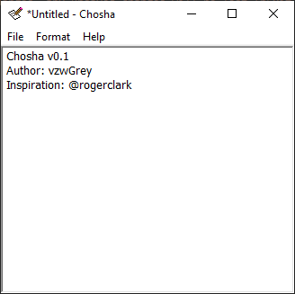

# Chosha

A Notepad clone for Windows, written in C using the Windows API.
Inspired by [Roger Clark's](https://github.com/rogerclark) project ["typer"](https://github.com/rogerclark/typer).

## Features

 - Opening existing files
 - Saving files
 - Saving files under a different name
 - Changing the editor's font
 - Saving font and window last position/dimensions in .ini (%appdata%/chosha/config.ini)
 - Warn about unsaved changes, and indicate them using an `*` in the title bar

## Known Bugs

 - Issues with UTF-8/ASCII encoding

## License

Licensed under the [MIT License](LICENSE.md).
